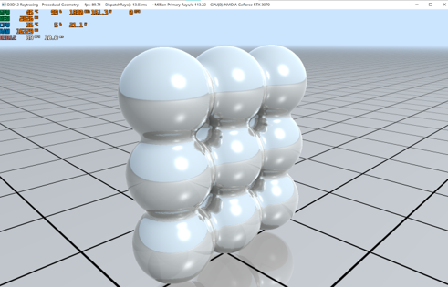

# Optimized Raytracing MetaBall: Acceleration and Transparent 
🔮GPU-based real-time raytracing rendering of transparent metaball. (Project for CS337 Computer Graphics)

## Features
* Implement BVH acceleration for MetaBalls
* Implement transparent (trace refraction rays) for MetaBalls
* GPU-based real-time rendering of the final scene (acceleration and transparent).

## Final Scene
Transparent metaballs: 25  
w: 1920, h: 1080  
recursion depth: 8  
fps: > 60

## Requirements
* GPU and driver with support for [DirectX 12 Ultimate](http://aka.ms/DirectX12UltimateDev)
* Windows 10 SDK 22000
* Shader model >= 6.5

## Controls
* ALT+ENTER - toggles between windowed and fullscreen modes.
* C - enable/disable camera animation.
* L - enable/disable light animation.

## Performance Benchmark
### BVH acceleration
We test two cases (with and without BVH acceleration) on a scene with 9 non-transparent metaballs. (1920 x 1080, recursion depth = 3)

| BVH    | fps  |
| ----------- | ---- |
| BVH unabled | 89   |
| BVH enabled | 601  |

- Without BVH  

- With BVH  

### Interval Refinement 
We test two cases (with interval refinment and without) on a scene with 125 non-transparent metaballs. (1920 x 1080, recursion depth = 3)

Visible differences in visual effects

### Transparent 
left: transparency in deformation  
middle: refracted virtual image  
right: total reflection  

## Known Issues
* Hardcoded shader index 
* MetaBalls need a wraper for closest-hit shader

## Reference Code
[DirectX-Graphics-Samples](https://github.com/microsoft/DirectX-Graphics-Samples)

## Report
[report](https://1drv.ms/w/s!AqTcPxnfNYjMj5ocZhqJx9TrpvWDQA?e=tQS7Rd)